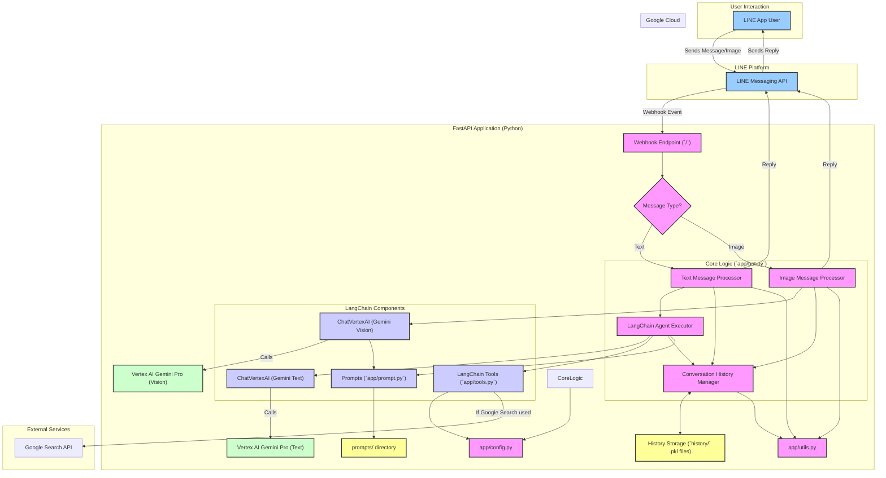

# architecture

```mermaid
graph TD
    subgraph "User Interaction"
        User["LINE App User"]
    end

    subgraph "LINE Platform"
        LINE_Messaging_API["LINE Messaging API"]
    end

    subgraph "FastAPI Application (Python)"
        direction LR
        Webhook["Webhook Endpoint (`/`)"]
        Router{"Message Type?"}

        subgraph "Core Logic (`app/bot.py`)"
            TextProcessor["Text Message Processor"]
            ImageProcessor["Image Message Processor"]
            HistoryManager["Conversation History Manager"]
            AgentExec["LangChain Agent Executor"]
        end

        subgraph "LangChain Components"
            LC_VertexAI_Text["ChatVertexAI (Gemini Text)"]
            LC_VertexAI_Vision["ChatVertexAI (Gemini Vision)"]
            LC_Tools["LangChain Tools (`app/tools.py`)"]
            LC_Prompts["Prompts (`app/prompt.py`)"]
        end

        Config["`app/config.py`"]
        Utils["`app/utils.py`"]
        PromptsDir["prompts/ directory"]
        HistoryDir["History Storage (`history/` .pkl files)"]

        Webhook --> Router
        Router -- Text --> TextProcessor
        Router -- Image --> ImageProcessor

        TextProcessor --> AgentExec
        ImageProcessor --> LC_VertexAI_Vision
        AgentExec --> LC_VertexAI_Text
        AgentExec --> LC_Tools

        LC_VertexAI_Text -->|Calls| VertexAI_Gemini_Text
        LC_VertexAI_Vision -->|Calls| VertexAI_Gemini_Vision

        HistoryManager <--> HistoryDir
        TextProcessor --> HistoryManager
        ImageProcessor --> HistoryManager
        AgentExec --> HistoryManager

        LC_Prompts --> PromptsDir
        AgentExec --> LC_Prompts
        LC_VertexAI_Vision --> LC_Prompts

        LC_Tools --> Config
        TextProcessor --> Utils
        ImageProcessor --> Utils
        HistoryManager --> Utils
        CoreLogic --> Config
    end

    subgraph "Google Cloud"
        VertexAI_Gemini_Text["Vertex AI Gemini Pro (Text)"]
        VertexAI_Gemini_Vision["Vertex AI Gemini Pro (Vision)"]
    end

    User -- Sends Message/Image --> LINE_Messaging_API
    LINE_Messaging_API -- Webhook Event --> Webhook
    TextProcessor -- Reply --> LINE_Messaging_API
    ImageProcessor -- Reply --> LINE_Messaging_API
    LINE_Messaging_API -- Sends Reply --> User

    %% External Services for Tools
    subgraph "External Services"
        GoogleSearchAPI["Google Search API"]
    end
    LC_Tools -- If Google Search used --> GoogleSearchAPI

    classDef fastapi fill:#f9f,stroke:#333,stroke-width:2px;
    classDef langchain fill:#ccf,stroke:#333,stroke-width:2px;
    classDef gcp fill:#cfc,stroke:#333,stroke-width:2px;
    classDef storage fill:#ff9,stroke:#333,stroke-width:2px;
    classDef user_platform fill:#9cf,stroke:#333,stroke-width:2px;

    class User,LINE_Messaging_API user_platform;
    class Webhook,Router,TextProcessor,ImageProcessor,HistoryManager,AgentExec,Config,Utils fastapi;
    class LC_VertexAI_Text,LC_VertexAI_Vision,LC_Tools,LC_Prompts langchain;
    class VertexAI_Gemini_Text,VertexAI_Gemini_Vision gcp;
    class PromptsDir,HistoryDir storage;
    class GoogleSearchAPI external_services;
```
